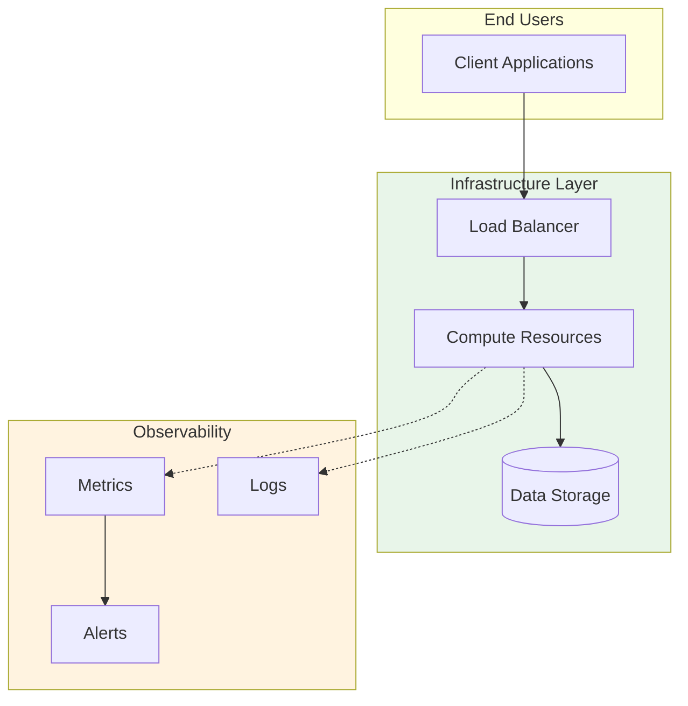

# 🏢 Enterprise Multi-Account Governance

> **AWS Organizations** governance with Control Tower, centralized compliance, and security automation

## Overview
Enterprise-grade multi-account AWS environment with automated governance, compliance monitoring, and security controls across all accounts.

## Use Case
Manage 100+ AWS accounts with centralized governance, security policies, and compliance monitoring for enterprise organizations.

## 🏗️ Architecture

### High-Level Architecture

## Tech Stack
AWS CDK Python, AWS Organizations, Control Tower, Security Hub, GuardDuty, AWS Config

## Architecture
Multi-OU structure with SCPs, automated account vending, centralized logging, and cross-account security monitoring.

**Author**: Rahul Ladumor  
**License**: MIT 2025
